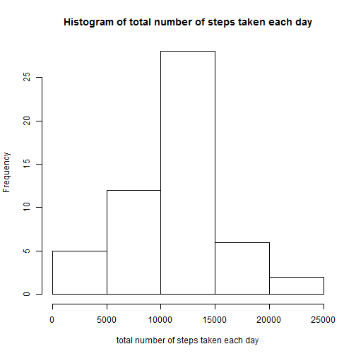
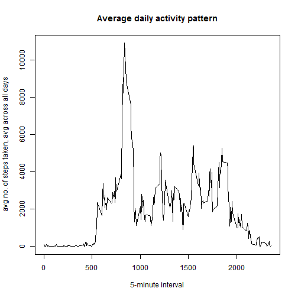
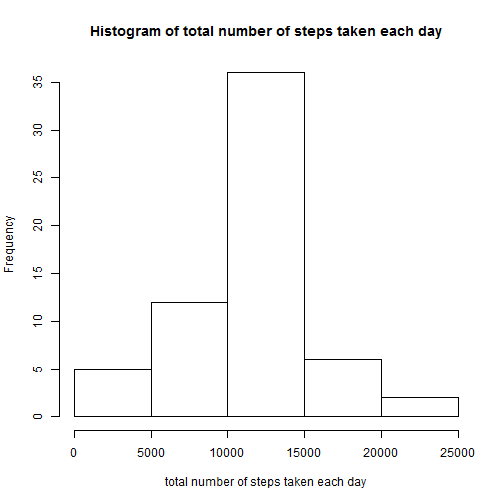
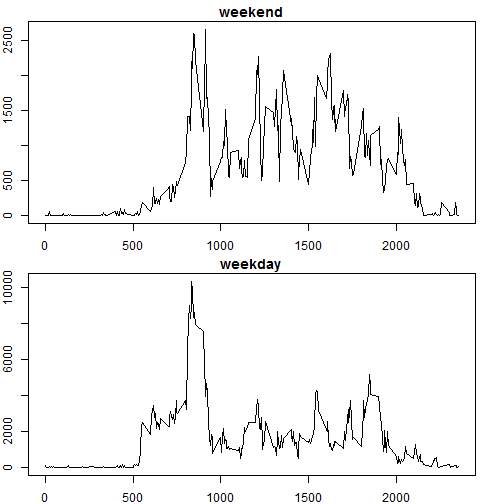

#Assignment Reproducible Research
  
  
##Introduction
It is now possible to collect a large amount of data about personal movement using activity monitoring devices such as a Fitbit, Nike Fuelband, or Jawbone Up. These type of devices are part of the "quantified self" movement -- a group of enthusiasts who take measurements about themselves regularly to improve their health, to find patterns in their behavior, or because they are tech geeks. But these data remain under-utilized both because the raw data are hard to obtain and there is a lack of statistical methods and software for processing and interpreting the data.

This assignment makes use of data from a personal activity monitoring device. This device collects data at 5 minute intervals through out the day. The data consists of two months of data from an anonymous individual collected during the months of October and November, 2012 and include the number of steps taken in 5 minute intervals each day.
  
  
  
##Data
The data for this assignment can be downloaded from the course web site:

Dataset: [Activity monitoring data (52kb)](activity.zip)
The variables included in this dataset are:

steps: Number of steps taking in a 5-minute interval (missing values are coded as NA)

date: The date on which the measurement was taken in YYYY-MM-DD format

interval: Identifier for the 5-minute interval in which measurement was taken

The dataset is stored in a comma-separated-value (CSV) file and there are a total of 17,568 observations in this dataset.

##Firstly setting some default options


```r
par(mfcol = c(1,1))
par(mar = c(5.1,4.1,4.1,2.1))
```

##Loading and preprocessing the data


```r
data<-read.csv("./activity/activity.csv")
```
  
  
  
##Q. What is mean total number of steps taken per day?

Histogram of the total number of steps taken each day


```r
TotalStepsPerDay<-aggregate(data$steps, by=list(Category=data$date), FUN=sum)
hist(TotalStepsPerDay$x,xlab = "total number of steps taken each day",main = "Histogram of total number of steps taken each day")
```

 

**Mean** of total number of steps taken per day

```r
mean(TotalStepsPerDay$x,na.rm = T)
```

```
## [1] 10766.19
```

**Median** total number of steps taken per day

```r
median(TotalStepsPerDay$x,na.rm = T)
```

```
## [1] 10765
```
  
  
  
##Q. What is the average daily activity pattern?

A time series plot (i.e. type = "l") of the 5-minute interval (x-axis) and the average number of steps taken, averaged across all days (y-axis)


```r
x<-aggregate(data$steps ~ data$interval, data, sum)
plot(x[,1],x[,2],type="l",xlab ="5-minute interval",ylab = "avg no. of steps taken, avg across all days",main = "Average daily activity pattern")
```

 

The 5-minute interval, on average across all the days in the dataset, contains the maximum number of steps


```r
maxStepsInterval<-x[x[,2]==max(x[,2]),1]
maxStepsInterval
```

```
## [1] 835
```
  
   
  
##Q. Imputing missing values

There are a number of days/intervals where there are missing values (coded as NA). The presence of missing 
days may introduce bias into some calculations or summaries of the data.

Total number of missing values in the dataset (i.e. the total number of rows with NAs)


```r
NaCount<-sum(is.na(data[,1]))
NaCount
```

```
## [1] 2304
```

Strategy for filling in all of the missing values in the dataset. I use mean for that 5-minute interval


```r
temp<-data[is.na(data[,1]),]
mx<-aggregate(data$steps ~ data$interval, data, mean)
for (i in 1:NaCount)
{
        temp[i,1]<-mx[ mx[,1]==data[is.na(data[,1]),3][i], 2];
}
```

A new dataset that is equal to the original dataset but with the missing data filled in


```r
ModifiedDataSet<-data
ModifiedDataSet[is.na(data[,1]),1]<-temp[,1]
```

Histogram of the total number of steps taken each day and Calculate and report the mean and median total number of steps taken per day


```r
mTotalStepsPerDay<-aggregate(ModifiedDataSet$steps, by=list(Category=ModifiedDataSet$date), FUN=sum)
hist(mTotalStepsPerDay$x,xlab = "total number of steps taken each day",main = "Histogram of total number of steps taken each day")
```

 

**Mean** of total number of steps taken per day

```r
mean(mTotalStepsPerDay$x,na.rm = T)
```

```
## [1] 10766.19
```
**Median** of total number of steps taken per day

```r
median(mTotalStepsPerDay$x,na.rm = T)
```

```
## [1] 10766.19
```
Yes, these valus differ from those calculated with missing values. It impacts the heights of each bar of histogram. It rises a little bit of their height, as compared to the case when there are missing values. But the mean and median almost remain same.
  
  
  
##Q. Are there differences in activity patterns between weekdays and weekends?

New factor variable in the dataset with two levels -- "weekday" and "weekend" indicating whether a given date is a weekday or weekend day.


```r
ModifiedDataSet<-transform(ModifiedDataSet,date=strptime(ModifiedDataSet[,2], format='%Y-%m-%d'))
ModifiedDataSet["weekDayType"]<-rep("weekday",nrow(ModifiedDataSet))
ModifiedDataSet[weekdays(ModifiedDataSet$date) %in% c("Saturday","Sunday"),"weekDayType"]<-rep("weekend",sum(weekdays(ModifiedDataSet$date) %in% c("Saturday","Sunday")))
ModifiedDataSet<-transform(ModifiedDataSet,weekDayType=as.factor(ModifiedDataSet$weekDayType))
```

Plot containing a time series plot (i.e. type = "l") of the 5-minute interval (x-axis) and the average number of steps taken, averaged across all weekday days or weekend days (y-axis).


```r
par(mfcol = c(2,1))
par(mar = c(2,2,1.5,2))

weekendData<-ModifiedDataSet[ModifiedDataSet[,4]=="weekend",]
weekendDataSummary<-aggregate(weekendData$steps ~ weekendData$interval, weekendData, sum)
plot(weekendDataSummary[,1],weekendDataSummary[,2],type="l",xlab ="",ylab = "",main = "weekend")

weekdayData<-ModifiedDataSet[ModifiedDataSet[,4]=="weekday",]
weekdayDataSummary<-aggregate(weekdayData$steps ~ weekdayData$interval, weekdayData, sum)
plot(weekdayDataSummary[,1],weekdayDataSummary[,2],type="l",xlab ="",ylab = "",main = "weekday")
```

 
